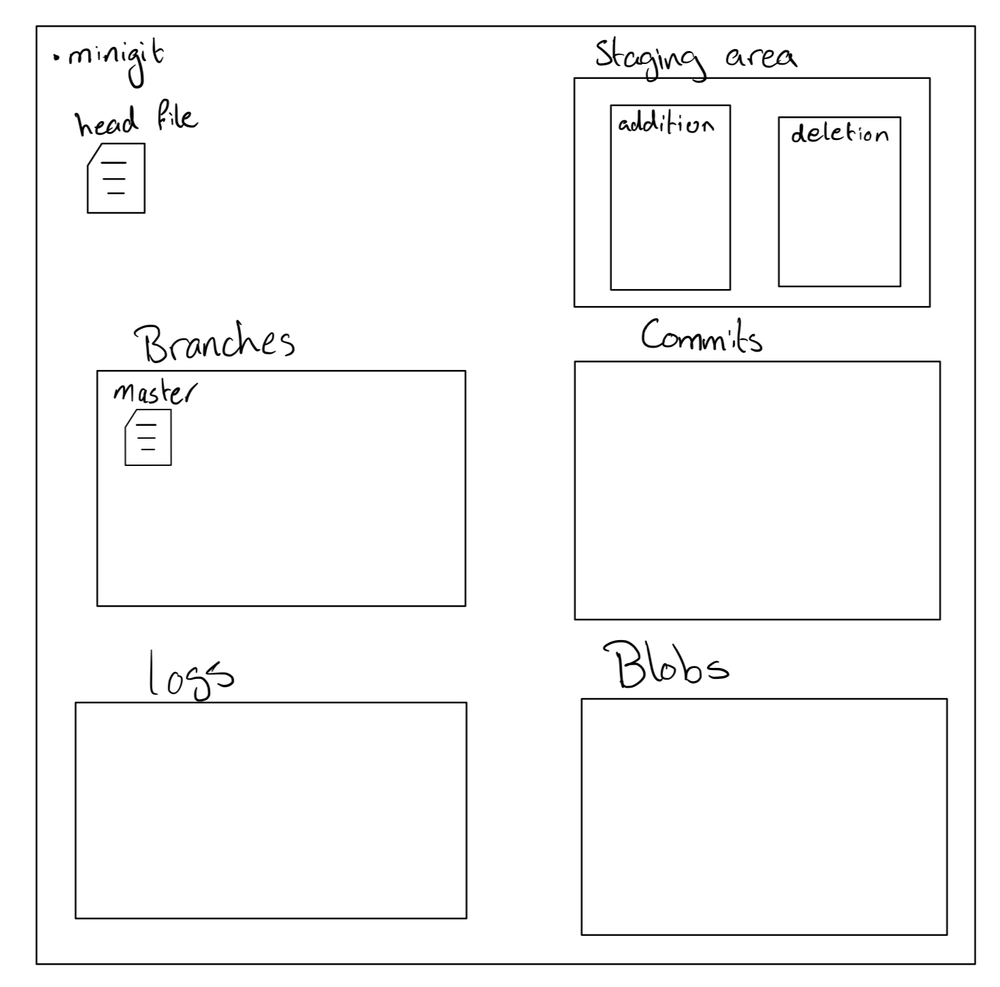

# Bonus Project: MiniGit

## Overview

For this project you will be implementing a version control system like Git. It has reduced functionality, but it will be able to do 
many of the things that git does, such as staging changes, making commits, creating branches, and more!

### Contents
- [Part 1  - Introduction](#part-1---introduction)
- [Part 2 - Setup](#part-2---setup)
- [Part 3 - Implementation](#part-3---implementation)
 	- [Intro to Git](#introduction-to-git)
	- [Intro to Persistence](#introduction-to-persistence)
- [Testing](#testing)

## Part 1 - Introduction
[(top)](#contents)

### Introduction to Git

[Link to tutorial](https://podcast.ucsd.edu/watch/sp24/dsc30_a01/7) (until 21:18)

Throughout this quarter, you have been using Git, but have you thought about how it works? Git is a version control system that keeps track of changes that happen in your directory and allows you to switch between different versions of your working directory. Sounds cool right? But how does it do this? Let's start first by understanding what makes up a git repository.

A git repository is just an area (a hidden folder) that contains a bunch of folders and files that store different versions of the working directory (the folder that contains that hidden folder). For simplicity, we will just explain the parts that we are going to implement in this project, but if you want to learn more about how git works you might find [this](https://www.youtube.com/playlist?list=PL9lx0DXCC4BNUby5H58y6s2TQVLadV8v7) playlist helpful.

The git commands we are interested in exploring are: git init, git status, git add, git commmit, git log, git branch, git checkout, git reset, and git rm.

We will be using these commands when we exlore the repository later. Git init is a command that initializes the git repository. Git status tells us the current status of the repository, whether something was added, deleted, or modified. Git add is a command that sets our changes into an area called INDEX or staging area (we will be using staging area to refer to it) to be ready to committed. Git rm removes a file from the directory and notes this change for the next commit. Git commit saves all the tracked changes since the last commit into a new version. Git log gives us information about the history of our commits. Git branch is a command that creates a new branch for us to work in, say, if we wanted to commit new experimental changes without modifying the main branch. Git checkout lets us change the branch. Git reset moves the pointer of a branch to a certain commit.

After we have defined the commands for git, let us walk through the changes of a git repository.

First, let's see what is the difference in contents of a git folder and non-git folder.

Create a folder using the following cmd:

```mkdir testingGit```

Change directory to the created folder:

```cd testingGit```

Let us see what is in this folder (including hidden folders) using the following cmd:

```ls -a```

You should get something like this:

```. ..```

Side information, these are basically references to the current directory and the parent directory. That's why when you use ```cd ..``` you go back to the parent folder.

Let's first see if the current folder is a git repository or not:

Run:
```git status```

Output:
```
fatal: not a git repository (or any of the parent directories): .git
```

As you can see, the folder isn't a repository and it says .git folder is missing. Now let's make this folder a git repository by initializing git:

```git init```

As we expect, the command should initialize the git repository. Now our folder is a git repository and we can verify this by running the status cmd:

```git status```

You should get the following output:

```
On branch main 

No commits yet 

nothing to commit (create/copy files and use "git add" to track)
```

As promised, git status showed us the current status of the repository. It says there is nothing to commit which indicates there is nothing that was changed in the repo yet.

Let's see what changed in our folder by running ```ls -a``` again. You should get the following output:

```.  ..  .git```

As you can see, a folder with the name '.git' has been created. A folder that starts with '.' in it's name is a hidden folder. Let's explore what is in this folder.

```
cd .git
ls
```

You should get the following result:

```
HEAD		description	info		refs
config		hooks		objects
```

Let's breakdown the contents that we need for this project. First, you will find that you have HEAD file.

##### HEAD

Head is a file that just stores the reference to the current branch. You can check it's content by running the following cmd:

Run:
```
cat HEAD
```

You should get the following output
```
ref: refs/heads/main
```

As we can see, it is just a path to a certain directory. This directory is what we refer to as branch and we will talk about it later.

Hint: You will need this to change between branches, but you might have a different content of the file.

##### objects

The object folder is where all the commits are stored. To explore this, let's change something in our repository and see how our .git folder would update.

```
cd ..
```
```
echo Hello World > test.txt
```
This should create a file with Hello World as its content. Let's check first the status of the repository:
```
git status
```
You should get the following output:

```
On branch main

No commits yet

Untracked files:
  (use "git add <file>..." to include in what will be committed)
	test.txt

nothing added to commit but untracked files present (use "git add" to track)
```
This is basically saying there are files that are in the working directory, but it is not added to the staging area and not commited. Hence, nothing yet changed in the .git folder, because as we said the .git just saves versions of what we tell it to save. To make .git start saving this, we will use the add cmd:

```
git add test.txt
```
```
git status
```
You should get the following output:
```
On branch main

No commits yet

Changes to be committed:
  (use "git rm --cached <file>..." to unstage)
	new file:   test.txt

```

This is telling us we have stuff that are ready to be commited, which means there are things in our staging area. Now let's see what happened in our .git folder:

``` 
cd .git
```
```
ls
```
You should get this output:
```
HEAD		description	index		objects
config		hooks		info		refs
```

As you can see, an index file has been created. This is the staging area. The file stores references of updated files, whether added, deleted or modified, stored in binary code. **Hint**: you will need a similar file or folder to help in implementing add command. Now let's go back and commit our change.
```
cd ..
```
```
git commit -m "added test.txt"
```
You will get an output similar to this:
```
[main (root-commit) 1ef99e1] added test.txt
 1 file changed, 1 insertion(+)
 create mode 100644 test.txt
```
Now let's check the status and then the .git folder:
```
git status
```
Output:
```
On branch main
nothing to commit, working tree clean
```
Which indicates everything is saved in the .git repository.

```
cd .git
```
```
ls
```
Output:
```
COMMIT_EDITMSG	config		hooks		info		objects
HEAD		description	index		logs		refs
```
You will notice that a foler logs has been created along with a another file and folder. We will just talk about logs as we don't need the other newly added folder and file for this project. Let's explore what changed in the folders we care about.

Run:
```
ls -R
```

This should show you a tree of everything in the folder. You will notice that the object folder has now a bunch of other folders that contain files with long names (Hash value). You will also notice that heads folder within the refs folder has a new file called main. This file stores a reference to the most recent commit (if you didn't change it by checkout).

After seeing the updates when we make a commit, let's see what happens when we create a new branch and do other commits.

```
cd ..
git branch
```
Output:
```
* main
```
This shows us the branches we have and the * indicates which branch are we currently on. Let's create a branch

```
git branch first_branch
git branch
```
Output:
```
  first_branch
* main
```
As you can see, a branch with the name 'first_branch' has been created. Let's see what changed in the .git folder:
```
cd .git
ls -R
```

Output:
```
COMMIT_EDITMSG	config		hooks		info		objects
HEAD		description	index		logs		refs

./hooks:
applypatch-msg.sample		pre-push.sample
commit-msg.sample		pre-rebase.sample
fsmonitor-watchman.sample	pre-receive.sample
post-update.sample		prepare-commit-msg.sample
pre-applypatch.sample		push-to-checkout.sample
pre-commit.sample		update.sample
pre-merge-commit.sample

./info:
exclude

./logs:
HEAD	refs

./logs/refs:
heads

./logs/refs/heads:
first_branch	main

./objects:
1e	55	86	info	pack

./objects/1e:
6dbf97adb05c42dcb537cd717e368812dc23b5

./objects/55:
7db03de997c86a4a028e1ebd3a1ceb225be238

./objects/86:
686f469ef45ef6d8f588fcabbf19d8403edacb

./objects/info:

./objects/pack:

./refs:
heads	tags

./refs/heads:
first_branch	main

./refs/tags:
```

The git branch [NAME] creates a branch with that name if it doesn't exist and makes this branch will store a reference of the commit head is pointing to (Note: Head points to the commit indirectly H -> branch -> commit). If you check the heads folder within refs, you will find a new file has been created named 'first_branch'. Notice that both main and first_branch are just normal text files (**Hint**: Helpful when implementing branch method). These files just store a reference to their most recent commits. This means that as of now, both of them should store the same thing as we didn't make any more commits in either. Let's verify this:

```
cd refs
cd heads
cat main
cat first_branch
```
Output:
```
86686f469ef45ef6d8f588fcabbf19d8403edacb
86686f469ef45ef6d8f588fcabbf19d8403edacb
```

Let's check what happens when we change the branch using **git checkout** command. 

Run:
```
git checkout first_branch
```
Output:
```
Switched to branch 'first_branch'
```
Run:
```
git branch
```
Output:
```
* first_branch
  main
```
As we can see, the asterisk is now next to first_branch instead of main which means that we are now on first_branch instead of main. Let's now inspect the .git folder.

Run:
```
cd .git
ls -R
```
You will get the same output as last time which might make you feel nothing has changed; however, there is one little thing that changed, which is the head file. As we said earlier, the head file just points towards the current branch, and since we changed the branch we should expect that head points towards first_branch instead of main, so let's verify this.

Run:
```
cat HEAD
```
Output:
```
ref: refs/heads/first_branch
```

We now know how the branches work and how they are stored.
Now that we have seen how the .git folder updates and showed the creation of the different objects, let's describe how we want the minigit to work. First, let's see the .minigit folder as an area of operation.



Note: Let's define each area in the figure and show what role does it play with respect to .git. First, the head file. This file should just store a reference to the current working directory, whether it is a branch or a commit (**Hint**: helpful when you implement checkout). Branches is a directory where you should store your branches (**Hint**: remember branches are just files that store a reference).

Now we can introduce SHA-1. It works like any other hash function, but it takes in an object and returns a 160-bit hash value. You may assume that if two objects have the same hash value when passed through SHA1, then they are equal (note: this is not generally true, only the converse is). This is how git computes hash codes for its objects.
 

### Introduction to Persistence

[Link to tutorial](https://podcast.ucsd.edu/watch/sp24/dsc30_a01/7) (starting at 23:28)

You may have noticed by now that you will need to a way to preserve the state of a program after it finishes running.
The way this is accomplished is through the concept of **persistence**. For example, if your program writes contents to a file,
the file will stay there even after the program finishes running.

First, let's start with basic persistence: writing plain text to a file.

It may be helpful to read up on the methods for the Java File class [here](https://docs.oracle.com/javase/8/docs/api/java/io/File.html).
We will walk you through some of the basic functionality now.

To create a File object, we type in:

```
File f = new File("example.txt");
```

Doing this just creates a reference to the path we want to work with, but it doesn't actually 
create the file. If we wanted to do that, we would type in

```
f.createNewFile();
```

**Note:** this command can be weird to deal with, and the helper methods `Utils.writeObject` and `Utils.writeContents` will handle this creation step for you, so you shouldn't have to use this method yourself in this project. It's just here for the purpose of demonstration

And now if you went through your file manager you would actually see a file called "example.txt". We can use the following helper 
method provided in the `Utils` class to write to the file.

```
Utils.writeContents(f, "DSC 30 is awesome!!");
```

What if we wanted to come back at a later point, maybe after the program ended, and see the contents of the file?
We can do so by calling the helper method:

```
Utils.readContentsAsString(f);
```

Which would then return the string "DSC 30 is awesome!!"

The file class can also manage directories. If we wanted to create a directory, we could do so by using the following methods:
```
File folder = new File("example-folder-location");
folder.mkdir();
```

Now, what happens if we wanted to store an entire object in a file? If we wanted to save a linked list, for example, maybe we could go through
each node and save the data on a new line. Then we can reconstruct the original linked list in the future whenever we want by going through the
file line by line and adding each element to a new linked list. However, this is inefficient and can quickly get very complicated for more advanced
data structures. The concept of **serialization** comes to the rescue.

If you go to the `Commit` class you may notice that it implements the `Serializable` interface.

```
public class Commit implements Serializable {
  ...
```

When a class implements the `Serializable` interface, it allows Java to serialize the object by turning it into a sequence of bytes that can be 
written into a file. Then, these bytes can be used to reconstruct the original object at a later time.

You should look at the `writeObject` and `readObject` methods in `Utils` (as well as all the other helper methods in the file).

It should be noted that serializing a file will recursively serialize all the pointers 
within that file. If you have a bunch of commits pointing to other commits, then serializing a commit will also store every commit before that one which is extremely
inefficient. You should think about how you can get around this.

For the above reason, if you want certain instance variables to not be serialized, you can add the keyword `transient` in front, such as
```
private transient Commit prev;
```
If you initialize the object using `readObject`, then transient fields will be set to `null`, which you may want to be careful about.

Finally, You should use `Utils.join` to compose paths to files so that you don't have to worry about inconsistencies between forward slashes and backslashes 
on different operating systems.


## Part 2 - Setup
[(top)](#contents)

### Starter Code

Please follow the following steps to get the startercode:
1. Create a new repository on github
    - **Make sure you DO NOT check off the option that says "Add a README file"**
2. Clone this empty repository to your system
3. Navigate to this repository from your terminal
4. Paste the following commands into the terminal:
  ```
  git remote add skeleton https://github.com/kalkulator413/dsc30-project1-startercode.git
  git pull skeleton main
  ```

Then, go to IntelliJ, select the "Open" option, and select the repository you just cloned. **DO NOT 
simply double click on the java files to open them in IntelliJ, you need to open the entire folder.**
Make sure you can run MiniGitTests.

You will be filling in the methods inside the `Repository` class in
the folder named `minigit/`. It may be helpful to design a `Commit` class and use utility
methods inside the `Utils` class.

## Part 3 - Implementation
[(top)](#contents)

Write the following methods inside the `Repository` class inside the `minigit` folder:
- [init](#init)
- [add](#add)
- [commit](#commit)
- [rm](#rm)
- [log](#log)
- [globalLog](#globallog)
- [find](#find)
- [checkout](#checkout)
- [branch](#branch)
- [rmBranch](#rmbranch)
- [reset](#reset)
- [status](#status)

To test your program, you will first want to compile your code by typing the following command into the terminal:

```Shell
javac minigit/Main.java
```

And then running your program with assorted commands, such as:

```Shell
java minigit.Main init
```

### init

```Java
public void init()
```
> **Usage**: `java minigit.Main init`

This method initializes the `.minigit` repository along with some blank slate repositories inside of it (think about how you can achieve this by using `Utils.join()` method and add one more layer of file/repository) like we've seen in **Part 1**.

This method also starts the entire version control system with one dummy commit with no files, no previous parent, and the placeholder message `"initial commit"` (see `Commit()`). It will also start the system with one single branch `main` (see `branch()`), which will be the current branch and points to the initial dummy commit.

> **Hint**: think about what repositories and files do you need inside `.minigit`, much like the ones inside a real `.git` repository, to do the following: tracking the **staging area**, tracking changes **added**, tracking changes **deleted**, tracking commits made, tracking individual file content, tracking the **HEAD**, tracking the branches, and lastly tracking the current branch.

### add

```Java
public void add(String[] args)
```

> **Usage** `java minigit.Main add <file name>`

This method adds a copy of the file (you may assume you will only use `add()` to add one file at a time) as it currently exists to the staging area (see the description of the `commit()`). For this reason, adding a file is also called _staging_ the file for _addition_. Staging an already-staged file overwrites the previous entry in the staging area with the new contents. The staging area should be somewhere in `.minigit` (see `init()`). If the current working version of the file is identical to the version in the current commit, do not stage it to be added, and remove it from the staging area if it is already there (as can happen when a file is changed, added, and then changed back to it’s original version).

> **Exception**: if the file does not exist, print the error message **`"File does not exist"`** and exit without changing anything (see `exitWithError()`)

### commit

```Java
public void commit(String[] args)
```

> **Usage**: `java minigit.Main commit <message>`

This method saves a snapshot of tracked files from the **current staging area** and **current commit** so they can be restored at a later time, creating a new commit. The commit is said to be tracking the saved files. By default, each commit’s snapshot of files will be exactly the same as its parent commit’s snapshot of files; it will keep versions of files exactly as they are, and not update them. A commit will only update the contents of files it is tracking that have been staged for addition at the time of commit, in which case the commit will now include the version of the file that was staged instead of the version it got from its parent (refer back to the demo to see graphical breakdown). A commit will save and start tracking any files that were staged for addition but weren’t tracked by its parent. Finally, files tracked in the current commit may be untracked in the new commit as a result being staged for removal by the `rm()` command (see below).

In short, a commit has the same file contents as its parent by default, only files staged for addition and removal are the updates to the commit.

> **Hint**:
> >
> - The staging area is cleared after a commit.
> - After the commit command, the new commit is added as a new node in the commit tree.
> - The commit just made becomes the “current commit”, and the HEAD pointer now points to it. The previous HEAD commit is this commit’s parent commit.
> The current branch should also be updated to point to the commit just made.
> >


> **Exception**: if given an empty commit message or no message at all, print the error message **`"Please enter a commit message."`** and exit without changing anything. If no files have been staged, print the error message **`"No changes added to the commit."`** and exit without changing anything.

### rm

```Java
public void rm(String[] args)
```

> **Usage**: `java minigit.Main rm <file name>`

This method first attempts to un-stage the file if it is currently staged for addition. If the file is instead tracked in the current commit, stages it for removal/deletion and removes the file from the working directory if the user has not already done so (do not remove it unless it is tracked in the current commit).

> **Exception**: if the file is neither staged or already tracked by the HEAD commit, print the error message **`"No reason to remove the file."`** and exit without changing anything.

### log

```Java
public void log()
```

> **Usage**: `java minigit.Main log`

This method prints the commit history starting at the current HEAD commit, display information about each commit backwards along the commit tree until the initial commit.

### globalLog

```Java
public void globalLog()
```

> **Usage**: `java minigit.Main globalLog`

This method displays information about **all commits** ever made and stored in the **commit area**. The order of the commits does not matter. Be aware that while **ideally** this method should give you the same set of commits as `log()`, think of why and when they differ.

> **Hint**: there is a useful method in `Utils.java` that will help you iterate over files within a directory.

### find

```Java
public void find(String[] args)
```

> **Usage**: `java minigit.Main find <commit message>`

This method finds and prints out the IDs of all commits that have the given commit message, one per line. The commit message is a single command line operand; to indicate a multi-word message, put the operand in quotation marks, as is the same for the commit message in the `command()` method.

> **Hint**: the same hint to `globalLog()` applies here.

> **Exception**: if no such commit exists with the same message, print the error message **`"Found no commit with that message."`** and exit without changing anything.

### checkout

```Java
public void checkout(String[] args)
```

> **Usage**:
>
> 1. `java minigit.Main checkout -- <file name>`
> 2. `java minigit.Main checkout <commit id> -- <file name>`
> 3. `java minigit.Main checkout <branch name>`
>

Given the use cases respective, this method:

1. Takes the version of the file as it exists in the HEAD commit and puts it in the working directory, overwriting the version of the file that’s already there if there is one. The new version of the file is not staged.
2. Takes the version of the file as it exists in the commit with the given id, and puts it in the working directory, overwriting the version of the file that’s already there if there is one. The new version of the file is not staged.
3. Takes all files in the commit at the head of the given branch, and puts them in the working directory, overwriting the versions of the files that are already there if they exist. Also, at the end of this command, the given branch will now be considered the current branch. Any files that are tracked in the current branch but are not present in the checked-out branch are deleted. The staging area is cleared, unless the checked-out branch is the current branch (see Exception below).

> **Exception**:

### branch

```Java
public void branch(String[] args)
```

> **Usage**: `java minigit.Main branch <branch name>`

This method creates a new branch with the given name, and points it at the current head commit. A branch is nothing more than a name for a reference to a commit node. This command does NOT immediately switch to the newly created branch (just as in real Git). Before you ever call branch, your code should be running with a default branch called `main` (same as the default branch since your initialization in `init()`).

> **Exception**: if a branch with the given name already exists, prints the error message **`"A branch with that name already exists."`** and exits without changing anything.

### rmBranch

```Java
public void rmBranch(String[] args)
```

> **Usage**: `java minigit.Main rm-branch <branch name>`

This method deletes the branch with the given name. This only means to delete the pointer associated with the branch; it does not mean to delete all commits that were created under the branch.

> **Exception**: if a branch with the given name does not exist, prints the error message **`"A branch with that name does not exist."`** and exits without changing anything. If attempting to remove the branch that you are currently on, prints the error message **`"Cannot remove the current branch."`** and exits without changing anything.

### reset

```Java
public void reset(String[] args)
```

> **Usage**: `java minigit.Main reset <commit-id>`

This method should check out all files in the given commit and remove all files that were not present at the time of the given commit. The staging area should be cleared and the HEAD pointer of the current branch should be updated 

> **Hint:** you might want to reuse an earlier method, since this accomplishes a very similar result with one modification

### status

```Java
public void status()
```

> **Usage**: `java minigit.Main status`

This method displays files staged for addition/removal as well as all existing branches. The active branch should have a `*` in front.

Example output:

```
=== Branches ===
*main
vranch2

=== Staged Files ===
one.txt
two.txt

=== Removed Files ===
three.txt

=== Modifications Not Staged For Commit ===
four.txt (deleted)
five.txt (modified)

=== Untracked Files ===
six.txt

```

## Testing
[(top)](#contents)

To do manual tests you can compile your files using `javac minigit/Main.java` and then run commands by entering things like `java minigit.Main init`. You can also run the provided tests, although they may require an older version of Java (JDK 17) and JUnit (Junit 4).

---

### Credits: This project was inspired by UC Berkeley.
